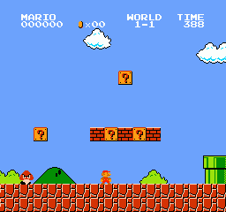
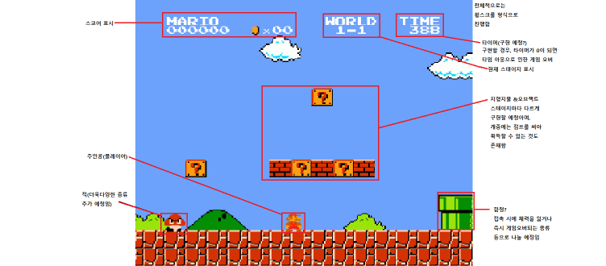

# 프로젝트명 : PAC-TORY 3D

# [컨셉]

## 메인 컨셉 : 팩맨
- 게임 자체가 팩맨에 대한 오마주로 제작 / 팩맨 게임의 요소 다수 추가
## 서브 컨셉 1 : 탈출
- 적들에게서 도망침과 동시에 목표를 달성해 끝까지 도착해야 게임이 클리어되도록 함 / 끝까지 도달하는 과정을 통해, 유저가 이 게임을 클리어했다는 부분에서 성취감을 느낄 수 있게 제작
## 서브 컨셉 2 : 수집
- 탈출을 위해선 카드키 20개를 수집하도록 함 / 탈출에 도움이 되는 기타 아이템들 존재
## 서브 컨셉 3 : 추격
- 상시 적이 쫒아오는 상태이기 떄문에 계속 움직여가며 플레이를 진행해야 함 / 플레이어의 긴장감 유발
## 서브 컨셉 4 : 메세지
- 카드키를 획득했을 때 얼마나 더 모아야 하는지, 아이템을 획득했을 때 어떤 효과인지 설명하는 등 다양한 상황에 맞는 메세지가 존재 / 플레이어에게 현재 상황을 인지시키고 이에 맞는 대응을 할 수 있도록 함
## 서브 컨셉 5 : 조작 단순화
- 게임의 진행은 씬을 전환할 때 쓰이는 스페이스바를 제외하면 오로지 4개의 방향키만으로 이루어짐 / 플레이어가 빠르게 게임에 대한 이해 가능
  
# [관련 이미지 & 동영상]
- 이미지
  
- 동영상
  
  
# [대표 이미지]

  
# [작품묘사]

> ### 적들을 없애거나 피하면서 앞으로 나아가는 고전 느낌의 2D 횡스크롤 액션 게임

  

# [<어딘가 이상한 모험 이야기> 구성 요소]

- 뭔가 기존에 본 것 같은 익숙함에도 조금씩은 예상외로 진행될 게임 진행에서 이름을 떠올림

 

## 1. 메커니즘

[도전 과제]

1. 적들을 피하거나 해치우며 스테이지의 끝까지 가는 것이 목표

[재미 요소]

1. 스코어링을 통한 점수 획득과 스테이지 클리어시 완주했다는 성취감

 

## 2. 이야기

[만들게 된 배경]  
고전 느낌의 게임을 한 번 만들어 보고 싶었다.

[카메라 관점]  
2D 횡스크롤 뷰

 

## 3. 미적요소

[디자인][컬러]  
2D 디자인 / 최대한 다양한 색을 넣어볼 예정

[음향]  
적을 처치할 때, 오브젝트를 획득할 때, 게임 오버 되었을 때, 게임을 클리어했을 때 등 각기 상황에 맞는 다른 음향 효과를 삽입할 예정
 

## 4. 기술

유니티 2D 플랫폼을 사용, PC 기반 게임으로 제작할 예정
