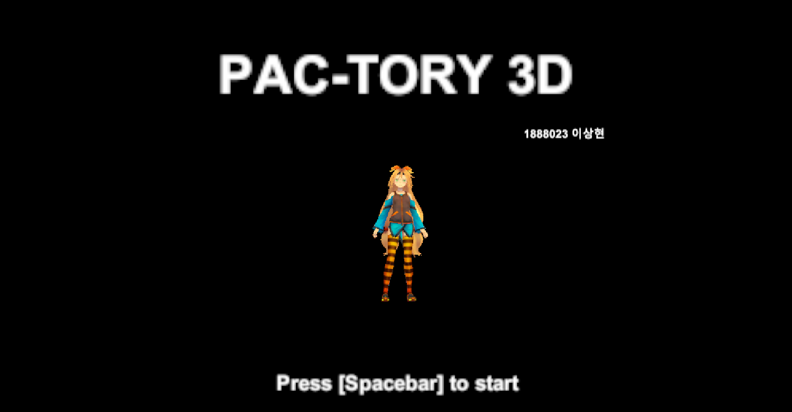
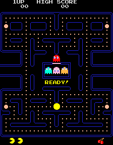
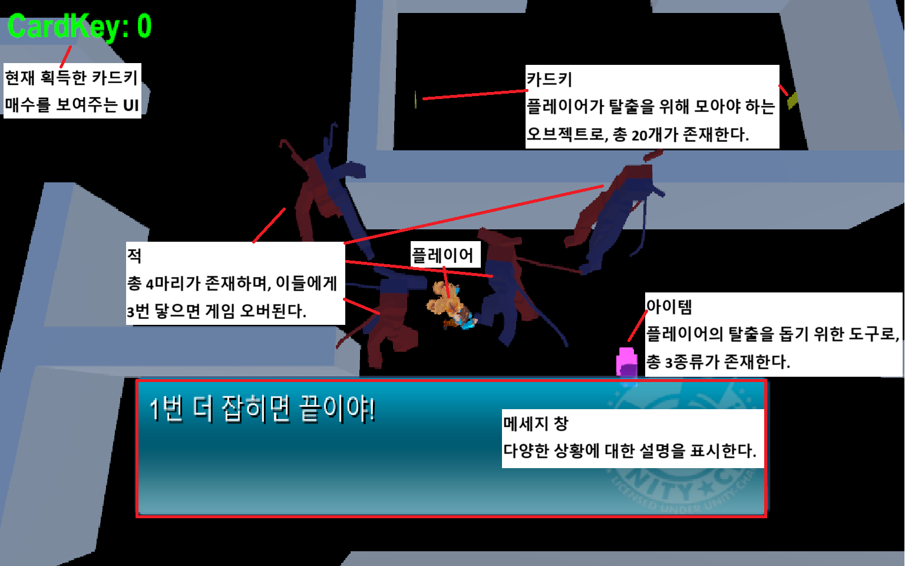
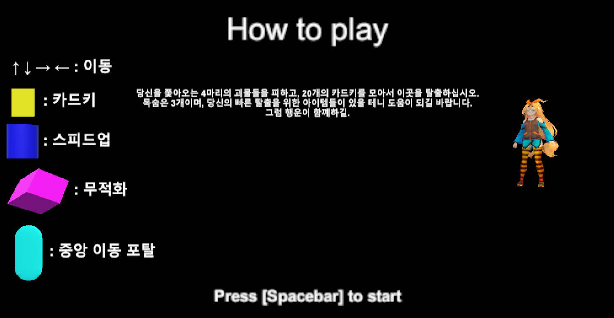
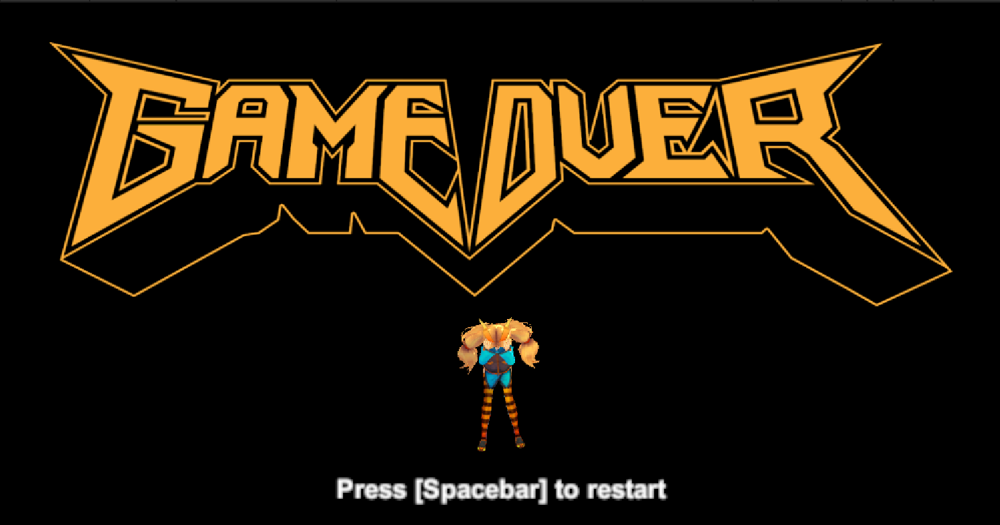
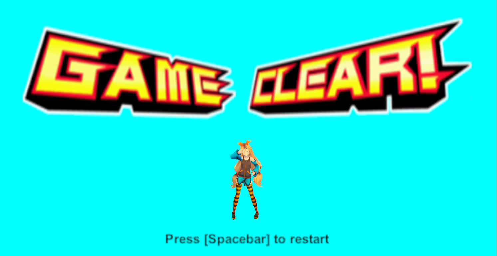

# 프로젝트명 : PAC-TORY 3D

# [컨셉]

## 메인 컨셉 : 팩맨
- 게임 자체가 팩맨에 대한 오마주로 제작 / 팩맨 게임의 요소 다수 추가
## 서브 컨셉 1 : 탈출
- 적들에게서 도망침과 동시에 목표를 달성해 끝까지 도착해야 게임이 클리어되도록 함 / 끝까지 도달하는 과정을 통해, 유저가 이 게임을 클리어했다는 부분에서 성취감을 느낄 수 있게 제작
## 서브 컨셉 2 : 수집
- 탈출을 위해선 카드키 20개를 수집하도록 함 / 탈출에 도움이 되는 기타 아이템들 존재
## 서브 컨셉 3 : 추격
- 상시 적이 쫒아오는 상태이기 떄문에 계속 움직여가며 플레이를 진행해야 함 / 플레이어의 긴장감 유발
## 서브 컨셉 4 : 메세지
- 카드키를 획득했을 때 얼마나 더 모아야 하는지, 아이템을 획득했을 때 어떤 효과인지 설명하는 등 다양한 상황에 맞는 메세지가 존재 / 플레이어에게 현재 상황을 인지시키고 이에 맞는 대응을 할 수 있도록 함
## 서브 컨셉 5 : 조작 단순화
- 게임의 진행은 씬을 전환할 때 쓰이는 스페이스바를 제외하면 오로지 4개의 방향키만으로 이루어짐 / 플레이어가 빠르게 게임에 대한 이해 가능
  
# [관련 이미지 & 동영상]
- 이미지
  
- 동영상
  
  
# [대표 이미지]

  
# [컨셉 & 대표 이미지 기반 작품 묘사]

> ### 컨셉 기반
- 플레이어 : 맵 중앙 하단에 위치, 화살표 키를 조작하여 상화좌우로 이동 가능
- 적 : 총 4마리 존재. 플레이어를 계속 추격하며, 3번 닿았을 경우 게임 오버
- 카드키 : 총 20개 존재. 맵 곳곳에 흩어져 있으며, 전부 모았을 경우 맵 하단의 '문'으로 탈출 가능
- 아이템 : 총 3종류 존재. 스피드업 / 무적화 / 포탈로 나뉘어져 있으며 플레이어에게 도움이 되도록 설계

> ### 대표 이미지 기반
- 배경 : 팩맨의 스테이지 구조를 모방한 미로형 맵
- UI : 화면 좌측 상단에 현재까지 모은 카드키의 개수를 표시 / 화면 하단에 특정한 상황 발생 시 메세지 창이 표시

  

# [PAC-TORY 3D 구성 요소]

- 고전 명작 게임인 팩맨을 오마주함과 동시에 팩맨과 비슷하면서도 또 다른 느낌으로 진행할 수 있게 설계

 

## 1. 메커니즘

[도전 과제]

- 적들을 피하면서 20개의 카드키를 모아 탈출하기

[재미 요소]

- 추격전을 통한 긴장감과 카드키를 오아 탈출하는 데에서 오는 성취감

 

## 2. 이야기

[만들게 된 배경]  
고전 느낌이 나는 게임을 만들어보고, 또 거기에 나름에 변주를 주어 색다른 게임을 만들어보고 싶었다.

[카메라 관점]  
위에서 플레이어를 내려다보는 3D 3인칭 시점으로 진행

 

## 3. 미적요소

[디자인]
전체적으로 3D 디자인이며, 유니티 내의 오브젝트들을 다양하게 활용해 표현

[컬러]  
기본적으로 게임 내 오브젝트들은 종류별로 전부 색이 다르게 설정

[음향]  
카드키를 획득할 때, 아이템을 획득했을 떄, 게임 오버 되었을 때, 게임을 클리어했을 때 등 각기 상황에 맞는 다른 음향 효과를 삽입

 

## 4. 기술

유니티 3D 플랫폼을 사용하여 PC 기반 게임으로 제작, 유니티 내 오브젝트 및 에셋을 활용

  

# [게임 시스템 디자인]
- 시작 화면

- 설명

- 게임 내 플레이 화면

- 게임 오버

- 게임 클리어

